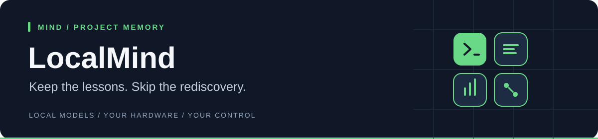

<div align="center">
  <h1>LocalMind</h1>
  <p><strong>Turn reviewed AI sessions into useful project memory. Locally.</strong></p>
  <p><a href="#install-localx">Install</a> · <a href="#start-with-the-browser-interface">First use</a> · <a href="#updates-and-troubleshooting">Updates &amp; help</a> · <a href="docs/README.md">All guides</a></p>
  <p>
    <a href="https://github.com/C0deGeek-dev/LocalMind/actions/workflows/ci.yml"></a>
    
    
  </p>
</div>

LocalMind is a local-first learning layer for AI-assisted development. It imports
opted-in sessions, removes likely secrets, extracts candidate lessons, asks a
human to review them, and stores accepted knowledge as readable project files.

| At a glance | |
|---|---|
| **Use it when** | Your agent keeps rediscovering the same fixes, decisions, and project conventions |
| **It remembers** | Reviewed lessons; the setup below uses manual approval |
| **It stores** | Readable Markdown memory plus a local SQLite audit/search index |
| **You review it in** | The CLI, or a localhost web app (`localmind ui`) |
| **Agents use it via** | The built-in LocalPilot integration, or MCP tools for other compatible agents |
| **It connects to** | LocalPilot natively; generic, Claude Code, and OpenAI Codex transcripts through the CLI |
| **Cloud required** | No |

<a name="quick-start"></a>

## Install LocalX

**No programming tools or compilation required.** The installer downloads ready-to-run
applications and checks their SHA-256 checksums. You get **LocalBox, LocalPilot,
LocalMind, and LocalBench**, plus `localx` for managing them and the llama.cpp
engine for running models. You do not need to clone this repository.

### 1. Run the installer

**Windows 10/11 (64-bit Intel or AMD):** open the Start menu, type **PowerShell**,
and open it. Paste this command, then press **Enter**:

```powershell
irm https://raw.githubusercontent.com/C0deGeek-dev/LocalPilot/main/install/install.ps1 | iex
```

**Linux (x86-64 or ARM64) / macOS (Apple Silicon):** open **Terminal**, paste
this command, then press **Enter**:

```sh
curl -fsSL https://raw.githubusercontent.com/C0deGeek-dev/LocalPilot/main/install/install.sh | sh
```

### 2. Let your terminal find the commands

`PATH` is the list of folders your terminal searches for applications. Add the
LocalX folder once so commands such as `localx update` work from any directory.

<details>
<summary><strong>Windows — paste this into the same PowerShell window</strong></summary>

```powershell
$localxBin = Join-Path $env:LOCALAPPDATA 'localx\bin'
$userPath = [Environment]::GetEnvironmentVariable('Path', 'User')
if (($userPath -split ';') -notcontains $localxBin) {
    [Environment]::SetEnvironmentVariable('Path', "$localxBin;$userPath", 'User')
}
$env:Path = "$localxBin;$env:Path"
```

This enables the commands in this window and saves the setting for future
terminals. If another open terminal cannot find them, close and reopen it.

</details>

<details>
<summary><strong>Linux / macOS — add LocalX to your shell's PATH</strong></summary>

Paste this into your terminal:

```sh
export PATH="${XDG_DATA_HOME:-$HOME/.local/share}/localx/bin:$PATH"
```

To keep it for future terminals, add the same line to your shell configuration:
`~/.bashrc` for Bash or `~/.zshrc` for Zsh. Use the directory printed by the
installer if it differs.

</details>

### 3. Check the installation

```sh
localx status
```

You should see the installed tools and engine. **Installing the tools does not
download an AI model**; choose one when you start using LocalBox.

Want to read the installer before running it, check platform support, or install
a specific version? See the [installation guide](https://github.com/C0deGeek-dev/LocalPilot/blob/main/docs/install.md).

## Start with the browser interface

LocalPilot already embeds LocalMind's learning engine. **You do not need to
build this repository to use it.** The standalone `localmind` command is useful
for browsing memory or working with sessions from other agents.

Open a terminal in the project folder you want to use. Create a file named
**`.localmind.toml`** in that folder with this content to enable local learning
and keep this project's memory scoped to the project:

```toml
[learning]
enabled = true
local_only = true
memory_root = ".localmind/memory"
allowed_scopes = ["project"]
excluded_paths = ["target/**", ".git/**"]

[review]
mode = "manual"
```

Then open the local browser interface:

```sh
localmind ui --project . --open
```

You can browse memory, inspect the review queue, and accept or reject lessons.
A new project starts empty; import a session or use LocalPilot to produce
candidate lessons. Here, `.` means the current project folder.

<details>
<summary><strong>Import a transcript and review lessons from the command line</strong></summary>

Replace `./session.txt` with your transcript file:

```sh
localmind import ./session.txt --project . --source open-ai-codex
localmind closeout <session-id> --project .
localmind review list --project .
localmind review accept <lesson-id> --project . --reviewer <your-name>
localmind promote <lesson-id> --project .
localmind search "your topic" --project .
```

Replace each `<…>` placeholder with the actual value; do not type the brackets.
Use the session ID reported by import and a lesson ID from the review queue.

</details>

## Updates and troubleshooting

| I want to… | Run |
|---|---|
| Update the whole stack and model engine | `localx update` |
| See installed versions | `localx status` |
| Diagnose installation problems | `localx doctor` |
| Retry an incomplete installation | `localx install` |

Ordinary installs use published releases; updates do not require Rust or Git.
If a command is “not recognized” or “not found”, complete the PATH step above.
If an older installation is taking precedence, `localx doctor` identifies it;
review its findings before using `localx doctor --fix` to remove old copies.

## Privacy by design

LocalMind keeps the knowledge extracted from your work under your control.

- **No usage telemetry is sent.** Sessions, candidate lessons, searches, and
  memory activity are not reported to LocalX or an analytics service.
- **Memory stays local.** Accepted knowledge is stored as readable Markdown and
  a local SQLite index in paths you control.
- **Learning is opt-in per project.** A repo with no `.localmind.toml` is never
  learned from; creating the file is the opt-in. Once enabled, accepted lessons
  write to both the project store **and** the same-machine global store by
  default (cross-project knowledge) — set `allowed_scopes = ["project"]` to keep
  a project's memory project-only. Nothing leaves the machine (`local_only`).
- **Inference is optional.** Deterministic local behavior works without a cloud
  service; any configured inference or embedding endpoint is an explicit choice.
- **Manual review is the default.** Candidate lessons are redacted and queued
  for your decision before they become durable knowledge.

> [!IMPORTANT]
> LocalMind requires project opt-in. The setup above uses manual review: you
> decide which lessons become durable memory. Optional trusted/automatic review
> modes must be configured separately.

## The learning loop

```text
opted-in session
      │
      ▼
redact ──> summarize ──> candidate lessons ──> human review
                                                   │
                               accepted only ──────┘
                                      │
                                      ▼
                         Markdown memory + local index
                                      │
                                      ▼
                           context for a later session
```

The current extractor is deterministic: explicit `Lesson:` markers plus
heuristics for failure-and-resolution pairs, repeated commands, and user
corrections. `SessionExtractor` is the seam for future model-backed extraction;
cloud inference is not the default.

## Review is the safety boundary

| Command | What happens |
|---|---|
| `localmind review list` | Show pending candidates |
| `localmind propose "…"` | Add a bounded, source-labelled pending candidate; never auto-accept |
| `localmind review inspect <id>` | Read the evidence before deciding |
| `localmind review accept <id>` | Mark the lesson as durable enough to keep |
| `localmind review edit <id> "…"` | Correct the lesson before accepting it |
| `localmind review reject <id>` | Reject it, optionally with a note |
| `localmind review defer <id>` | Leave it for later |
| `localmind promote <id>` | Write an accepted lesson to project memory |
| `localmind audit` | Inspect the local decision history |

Promotion writes readable Markdown below `.localmind/memory/project/`, updates
the local search and relationship index, and records an audit event in
`.localmind/localmind.sqlite`.

<details>
<summary><strong>Explore storage, sync, MCP, and code/document indexing</strong></summary>

## What gets written

An imported session receives a deterministic folder under
`.localmind/sessions/<session-id>/`:

```text
transcript.redacted.txt
metadata.json
summary.json
candidates.json
```

Likely API keys, bearer tokens, token/password assignments, connection-string
passwords, private keys, and configured sensitive paths are redacted before the
transcript is persisted.

## Context and skill drafts

Accepted memory can be packaged for different agent hosts:

```sh
localmind context export "release checklist" --target localpilot --project .
localmind context export "deterministic fixtures" --target open-ai-codex --project .
```

Repeated workflows can become disabled `SKILL.md` drafts:

```sh
localmind skills generate --project .
localmind skills list --project .
localmind skills inspect <skill-id> --project .
localmind skills export <skill-id> --project .
```

LocalMind never installs or activates a generated skill by itself.

## Cross-device sync

Memory can follow you between your machines, encrypted end-to-end. LocalMind
opens no sockets — you point it at a folder your own transport already syncs
(Syncthing, OneDrive, a network share, a private git repo).

```sh
# On each machine: publish its card, then enroll the other after checking the
# fingerprint matches on both screens.
localmind sync device-card --project .
localmind sync enroll --card ./their-card.json --confirm-fingerprint <fingerprint> --project .
localmind sync devices --project .

# Exchange memory through the folder, then review what arrived.
localmind sync run --folder /path/to/synced/folder --project .
localmind sync status --project .
```

Every synced memory is signed and sealed to your enrolled devices, so the folder
only ever holds ciphertext. Incoming memory lands in the **review queue**, never
straight into active memory; an unknown signer is rejected, and a conflicting
edit is surfaced for you to reconcile rather than silently overwritten.

## Review in the browser

`localmind ui` serves the same store as a self-contained localhost web app —
one binary, no build step, no external assets:

```sh
localmind ui --project . --open
```

Tabs: a dashboard, the review queue (bulk actions; `j`/`k` to move, `a`/`r`/`d`
to decide, `e` to edit, `x` to select), the memory browser with provenance and
audited delete, semantic search over ingested docs, an interactive code-graph
view, and the audit log. Every endpoint is a thin wrapper over the same store
methods the CLI calls, so the review gate cannot be bypassed. The server binds
`127.0.0.1` only (default port 8091); `--token <secret>` additionally requires
`?token=` on every request if the port is ever exposed beyond the machine.

## Serve tools over MCP

`localmind mcp serve` speaks the Model Context Protocol over stdio — a
synchronous, newline-delimited JSON-RPC 2.0 loop, no async runtime — so an
MCP-capable agent can query LocalMind directly:

```sh
localmind mcp serve --project .
```

Twelve tools: `memory_search`, `memory_context_export`, `doc_search`,
`memory_status` (a read-only store-readiness snapshot), `memory_primer` (a
read-only queryless project primer of the most salient accepted memory), the four
`memory_symbol_*` code-graph tools, skill list/fetch, and `memory_propose`. The
server binds to the project it is launched in — `mcp serve` walks up from the
launch directory to the nearest `.localmind.toml`, so no fixed `--project` is
needed. The proposal tool is the only write surface: it is additive, bounded,
retry-safe, capped per server session, and can only enqueue a human-review
candidate. It
never accepts or promotes memory, including under automatic review mode.

## Index code and documentation

Two ingest commands feed the query tools above:

```sh
localmind graph reindex . --project .
localmind ingest docs ./docs --project .
```

`graph reindex` walks a repository tree (VCS, build, and vendored directories
are skipped; only source and Markdown extensions are candidates, so a stray
binary cannot abort the pass) and drives the resumable code-graph reindexer to
completion. `ingest docs` chunks Markdown at headings, embeds each passage
into the semantic doc index, and is idempotent: re-ingesting an edited or
shrunk file replaces its passages and prunes the stale tail. Embedding is
best-effort — without a reachable embedding endpoint the text is stored
un-vectored and still browsable. When LocalPilot already owns the configured
server, the standalone CLI takes a machine-global lease for the complete
embedding-capable command lifetime so LocalPilot cannot stop it mid-request.
LocalMind never starts, stops, discovers, or locates LocalBox: a reachable
user-managed endpoint is used without an ownership claim, and an unreachable
endpoint degrades truthfully. `localmind backfill` is the exception because its
entire job is embedding; with pending rows it exits with the exact repair cue
`localbox embed-serve` instead of reporting a successful empty sweep.

</details>

## Evidence so far

In the controlled `localbench-uplift-v1` evaluation, injecting accepted lessons
lifted a deliberately headroom-rich held-out suite from **0% to 100%**. The
effect held on a second local model. This is evidence that reviewed memory can
change outcomes, not a claim that every task becomes solvable.

<details>
<summary><strong>Architecture and integration reference for host authors</strong></summary>

## Architecture for host authors

The learning engine is split into host-neutral Rust crates. LocalPilot embeds it
through an adapter; the core never depends on LocalPilot. The standalone CLI
uses the same contracts for generic transcripts and other agent hosts.

### What the standalone `localmind` CLI exposes

Several engine capabilities are **implemented and tested in the crates but
mounted by a host** (LocalPilot), not surfaced by this binary. Know which you get
from the CLI alone:

| Capability | Standalone `localmind` CLI | Notes |
|---|---|---|
| Import → closeout → review → promote → search (FTS5) → audit → context export | ✅ | The core loop |
| Signed memory bundle export/import, `eval`, `status`, skill drafts | ✅ | |
| Batch `insights` (distill/research) | ✅ (needs `[inference]`) | Model-backed; skipped with a notice when no endpoint |
| Hybrid keyword+vector search, rerank | host-mounted | The LocalPilot host runs the rerank stage on its memory-injection retrieval (D-LM-0026); CLI **memory** search stays keyword (FTS5). The semantic surface the CLI does own is the doc index: `ingest docs` embeds documentation, and the `doc_search` MCP tool or the UI Docs tab retrieves it |
| Code graph ingest + query, MCP graph tools | ✅ | `graph reindex` builds the graph over a repository tree; `mcp serve` and the UI Graph tab query it. Change-impact and the cold-start primer remain host-mounted |
| Freshness pass, usage stats, provenance, source revalidation, memory delete | host-mounted | Exposed by the LocalPilot `learning`/`memory` commands |

The `[retrieval] rerank` config keys take effect through a host that runs the
rerank stage (default off; without an embedding endpoint the deterministic
blend order is the whole story).

**`local_only` note.** `local_only = true` is mandatory (setting it `false` is a
typed error) and constrains both storage scope and inference egress. Configured
inference endpoints must be explicit loopback destinations and are checked again
at request time; hostnames and remote/LAN addresses are refused rather than
resolved optimistically (D-LM-0034).

| Area | Start here |
|---|---|
| Product scope and implementation status | [Vision](vision.md) |
| Files, schema, versioning, and host contracts | [On-disk contract](docs/on-disk-contract.md) |
| Architecture decisions | [Decisions](docs/decisions.md) |
| Research ingestion and distillation | [Research distillation](docs/research-distillation.md) |
| Full documentation map | [Docs index](docs/README.md) |
| Release history | [Changelog](CHANGELOG.md) |

</details>

<details>
<summary><strong>Developing LocalMind</strong></summary>

The local gate mirrors CI:

```sh
cargo fmt --check
cargo clippy --workspace --all-targets -- -D warnings
cargo test --workspace
cargo check --workspace
cargo run -p localmind-cli -- --help
```

CI aliases live in `.cargo/config.toml`: `cargo ci-fmt`, `cargo ci-lint`,
`cargo ci-test`, and `cargo ci-doctest`. `localmind eval` runs the memory-quality
regression suite and can emit JSON with `--json`.

</details>

## LocalX

LocalMind is the learning layer in the
[LocalX toolchain](https://c0degeek-dev.github.io/LocalStack/):

| Project | Role |
|---|---|
| [LocalBox](https://github.com/C0deGeek-dev/LocalBox) | Run local models |
| [LocalBench](https://github.com/C0deGeek-dev/LocalBench) | Find fast, stable settings |
| [LocalPilot](https://github.com/C0deGeek-dev/LocalPilot) | Code through the agent harness |
| **LocalMind** | Turn reviewed sessions into reusable project memory |

<details>
<summary><strong>Build from source (developers only)</strong></summary>

The ready-to-run installation above is sufficient for normal use. Building from
source requires Rust and the platform build tools. Run these commands from the
repository checkout unless a clone command is shown:

```sh
git clone https://github.com/C0deGeek-dev/LocalMind.git
cd LocalMind
cargo build -p localmind-cli
cargo run -p localmind-cli -- --help
```

</details>

## License


LocalX-owned source is available under the
[PolyForm Noncommercial License 1.0.0](LICENSE). Commercial use requires a
separate license. See [LICENSING.md](LICENSING.md) for the commercial contact,
the 30 August 2026 licensing boundary, and third-party terms.
